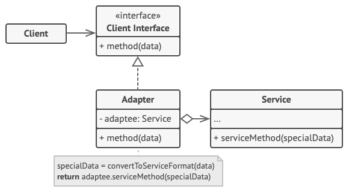
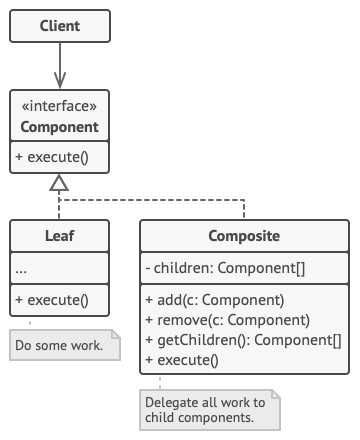
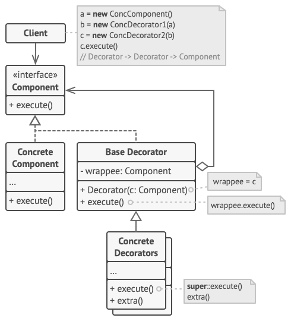

* [Creational Patterns](#creational-patterns)
  * [Factory Method](#factory-method)
  * [Abstract Factory](#abstract-factory)
  * [Builder](#builder)
  * [Prototype](#prototype)
  * [Singleton](#singleton)
* [Structural Patterns](#structural-patterns)
  * [Adapter](#adapter)
  * [Bridge](#bridge)
  * [Composite](#composite)

# Creational Patterns

## Factory Method 
[(Code Example)](https://github.com/VitaliyRysich/Design-Patterns/tree/master/src/main/java/creational/factory_method)

Factory Method is a creational design pattern that provides an interface for creating objects in a superclass, but allows subclasses to alter the type of objects that will be created.

1. The Product declares the interface, which is common to all objects that can be produced by the creator and its subclasses.
2. Concrete Products are different implementations of the product interface.
3. The Creator class declares the factory method that returns new product objects. It’s important that the return type of this method matches the product interface.
You can declare the factory method as abstract to force all subclasses to implement their own versions of the method. As an alternative, the base factory method can return some default product type.
Note, despite its name, product creation is not the primary responsibility of the creator. Usually, the creator class already has some core business logic related to products. The factory method helps to decouple this logic from the concrete product classes. Here is an analogy: a large software development company can have a training department for programmers. However, the primary function of the company as a whole is still writing code, not producing programmers.
4. Concrete Creators override the base factory method so it returns a different type of product.
Note that the factory method doesn’t have to create new instances all the time. It can also return existing objects from a cache, an object pool, or another source.

### How to Implement
1. Make all products follow the same interface. This interface should declare methods that make sense in every product.
2. Add an empty factory method inside the creator class. The return type of the method should match the common product interface.
3. In the creator’s code find all references to product constructors. One by one, replace them with calls to the factory method, while extracting the product creation code into the factory method.
4. You might need to add a temporary parameter to the factory method to control the type of returned product.
5. At this point, the code of the factory method may look pretty ugly. It may have a large switch operator that picks which product class to instantiate. But don’t worry, we’ll fix it soon enough.
6. Now, create a set of creator subclasses for each type of product listed in the factory method. Override the factory method in the subclasses and extract the appropriate bits of construction code from the base method.
7. If there are too many product types and it doesn’t make sense to create subclasses for all of them, you can reuse the control parameter from the base class in subclasses.
8. For instance, imagine that you have the following hierarchy of classes: the base Mail class with a couple of subclasses: AirMail and GroundMail; the Transport classes are Plane, Truck and Train. While the AirMail class only uses Plane objects, GroundMail may work with both Truck and Train objects. You can create a new subclass (say TrainMail) to handle both cases, but there’s another option. The client code can pass an argument to the factory method of the GroundMail class to control which product it wants to receive.

### Pros
* You avoid tight coupling between the creator and the concrete products.
 * Single Responsibility Principle. You can move the product creation code into one place in the program, making the code easier to support.
 * Open/Closed Principle. You can introduce new types of products into the program without breaking existing client code.
 
 ### Cons
 * The code may become more complicated since you need to introduce a lot of new subclasses to implement the pattern. The best case scenario is when you’re introducing the pattern into an existing hierarchy of creator classes.

## Abstract Factory
[(Code Example)](https://github.com/VitaliyRysich/Design-Patterns/tree/master/src/main/java/creational/abstract_factory)

Abstract Factory is a creational design pattern that lets you produce families of related objects without specifying their concrete classes.

1. Abstract Products declare interfaces for a set of distinct but related products which make up a product family.
2. Concrete Products are various implementations of abstract products, grouped by variants. Each abstract product (chair/sofa) must be implemented in all given variants (Victorian/Modern).
3. The Abstract Factory interface declares a set of methods for creating each of the abstract products.
4. Concrete Factories implement creation methods of the abstract factory. Each concrete factory corresponds to a specific variant of products and creates only those product variants.
5. Although concrete factories instantiate concrete products, signatures of their creation methods must return corresponding abstract products. This way the client code that uses a factory doesn’t get coupled to the specific variant of the product it gets from a factory. The Client can work with any concrete factory/product variant, as long as it communicates with their objects via abstract interfaces.

### How to Implement
1. Map out a matrix of distinct product types versus variants of these products.
2. Declare abstract product interfaces for all product types. Then make all concrete product classes implement these interfaces.
3. Declare the abstract factory interface with a set of creation methods for all abstract products.
4. Implement a set of concrete factory classes, one for each product variant.
5. Create factory initialization code somewhere in the app. It should instantiate one of the concrete factory classes, depending on the application configuration or the current environment. Pass this factory object to all classes that construct products.
6. Scan through the code and find all direct calls to product constructors. Replace them with calls to the appropriate creation method on the factory object.

 ### Pros
 * You can be sure that the products you’re getting from a factory are compatible with each other.
 * You avoid tight coupling between concrete products and client code.
 * Single Responsibility Principle. You can extract the product creation code into one place, making the code easier to support.
 * Open/Closed Principle. You can introduce new variants of products without breaking existing client code.

 ### Cons
 * The code may become more complicated than it should be, since a lot of new interfaces and classes are introduced along with the pattern.

## Builder
[(Code Example)](https://github.com/VitaliyRysich/Design-Patterns/tree/master/src/main/java/creational/builder)

Builder is a creational design pattern that lets you construct complex objects step by step. The pattern allows you to produce different types and representations of an object using the same construction code.

1. The Builder interface declares product construction steps that are common to all types of builders.
2. Concrete Builders provide different implementations of the construction steps. Concrete builders may produce products that don’t follow the common interface.
3. Products are resulting objects. Products constructed by different builders don’t have to belong to the same class hierarchy or interface.
4. The Director class defines the order in which to call construction steps, so you can create and reuse specific configurations of products.
5. The Client must associate one of the builder objects with the director. Usually, it’s done just once, via parameters of the director’s constructor. Then the director uses that builder object for all further construction. However, there’s an alternative approach for when the client passes the builder object to the production method of the director. In this case, you can use a different builder each time you produce something with the director.

### How to Implement
1. Make sure that you can clearly define the common construction steps for building all available product representations. Otherwise, you won’t be able to proceed with implementing the pattern.
2. Declare these steps in the base builder interface.
3. Create a concrete builder class for each of the product representations and implement their construction steps.
4. Don’t forget about implementing a method for fetching the result of the construction. The reason why this method can’t be declared inside the builder interface is that various builders may construct products that don’t have a common interface. Therefore, you don’t know what would be the return type for such a method. However, if you’re dealing with products from a single hierarchy, the fetching method can be safely added to the base interface.
5. Think about creating a director class. It may encapsulate various ways to construct a product using the same builder object.
6. The client code creates both the builder and the director objects. Before construction starts, the client must pass a builder object to the director. Usually, the client does this only once, via parameters of the director’s constructor. The director uses the builder object in all further construction. There’s an alternative approach, where the builder is passed directly to the construction method of the director.
7. The construction result can be obtained directly from the director only if all products follow the same interface. Otherwise, the client should fetch the result from the builder.

### Pros
* You can construct objects step-by-step, defer construction steps or run steps recursively.
* You can reuse the same construction code when building various representations of products.
* Single Responsibility Principle. You can isolate complex construction code from the business logic of the product.

### Cons
* The overall complexity of the code increases since the pattern requires creating multiple new classes.

## Prototype
[(Code Example)](https://github.com/VitaliyRysich/Design-Patterns/tree/master/src/main/java/creational/prototype)

Prototype is a creational design pattern that lets you copy existing objects without making your code dependent on their classes.

1. The Prototype interface declares the cloning methods. In most cases, it’s a single clone method.
2. The Concrete Prototype class implements the cloning method. In addition to copying the original object’s data to the clone, this method may also handle some edge cases of the cloning process related to cloning linked objects, untangling recursive dependencies, etc.
3. The Client can produce a copy of any object that follows the prototype interface.

### How to Implement
1. Create the prototype interface and declare the clone method in it. Or just add the method to all classes of an existing class hierarchy, if you have one.
2. A prototype class must define the alternative constructor that accepts an object of that class as an argument. The constructor must copy the values of all fields defined in the class from the passed object into the newly created instance. If you’re changing a subclass, you must call the parent constructor to let the superclass handle the cloning of its private fields.
3. If your programming language doesn’t support method overloading, you may define a special method for copying the object data. The constructor is a more convenient place to do this because it delivers the resulting object right after you call the new operator.
4. The cloning method usually consists of just one line: running a new operator with the prototypical version of the constructor. Note, that every class must explicitly override the cloning method and use its own class name along with the new operator. Otherwise, the cloning method may produce an object of a parent class.
5. Optionally, create a centralized prototype registry to store a catalog of frequently used prototypes.
6. You can implement the registry as a new factory class or put it in the base prototype class with a static method for fetching the prototype. This method should search for a prototype based on search criteria that the client code passes to the method. The criteria might either be a simple string tag or a complex set of search parameters. After the appropriate prototype is found, the registry should clone it and return the copy to the client.
7. Finally, replace the direct calls to the subclasses’ constructors with calls to the factory method of the prototype registry.

### Pros
* You can clone objects without coupling to their concrete classes.
* You can get rid of repeated initialization code in favor of cloning pre-built prototypes.
* You can produce complex objects more conveniently.
* You get an alternative to inheritance when dealing with configuration presets for complex objects.

### Cons
* Cloning complex objects that have circular references might be very tricky.

## Singleton
[(Code Example)](https://github.com/VitaliyRysich/Design-Patterns/tree/master/src/main/java/creational/singleton)

Singleton is a creational design pattern that lets you ensure that a class has only one instance, while providing a global access point to this instance.

1. The Singleton class declares the static method getInstance that returns the same instance of its own class.
2. The Singleton’s constructor should be hidden from the client code. Calling the getInstance method should be the only way of getting the Singleton object.

### How to Implement
1. Add a private static field to the class for storing the singleton instance.
2. Declare a public static creation method for getting the singleton instance.
3. Implement “lazy initialization” inside the static method. It should create a new object on its first call and put it into the static field. The method should always return that instance on all subsequent calls.
4. Make the constructor of the class private. The static method of the class will still be able to call the constructor, but not the other objects.
5. Go over the client code and replace all direct calls to the singleton’s constructor with calls to its static creation method.

### Pros
* You can be sure that a class has only a single instance.
* You gain a global access point to that instance.
* The singleton object is initialized only when it’s requested for the first time.

### Cons
* Violates the Single Responsibility Principle. The pattern solves two problems at the time.
* The Singleton pattern can mask bad design, for instance, when the components of the program know too much about each other.
* The pattern requires special treatment in a multithreaded environment so that multiple threads won’t create a singleton object several times.
* It may be difficult to unit test the client code of the Singleton because many test frameworks rely on inheritance when producing mock objects. Since the constructor of the singleton class is private and overriding static methods is impossible in most languages, you will need to think of a creative way to mock the singleton. Or just don’t write the tests. Or don’t use the Singleton pattern.

# Structural Patterns

## Adapter
[(Code Example)](https://github.com/VitaliyRysich/Design-Patterns/tree/master/src/main/java/structural/adapter)

Adapter is a structural design pattern that allows objects with incompatible interfaces to collaborate.

This implementation uses the object composition principle: the adapter implements the interface of one object and wraps the other one. It can be implemented in all popular programming languages.
1. The Client is a class that contains the existing business logic of the program.
2. The Client Interface describes a protocol that other classes must follow to be able to collaborate with the client code.
3. The Service is some useful class (usually 3rd-party or legacy). The client can’t use this class directly because it has an incompatible interface.
4. The Adapter is a class that’s able to work with both the client and the service: it implements the client interface, while wrapping the service object. The adapter receives calls from the client via the adapter interface and translates them into calls to the wrapped service object in a format it can understand.
5. The client code doesn’t get coupled to the concrete adapter class as long as it works with the adapter via the client interface. Thanks to this, you can introduce new types of adapters into the program without breaking the existing client code. This can be useful when the interface of the service class gets changed or replaced: you can just create a new adapter class without changing the client code.

### How to Implement

1. Make sure that you have at least two classes with incompatible interfaces:
2. A useful service class, which you can’t change (often 3rd-party, legacy or with lots of existing dependencies).
One or several client classes that would benefit from using the service class.
Declare the client interface and describe how clients communicate with the service.
3. Create the adapter class and make it follow the client interface. Leave all the methods empty for now.
4. Add a field to the adapter class to store a reference to the service object. The common practice is to initialize this field via the constructor, but sometimes it’s more convenient to pass it to the adapter when calling its methods.
5. One by one, implement all methods of the client interface in the adapter class. The adapter should delegate most of the real work to the service object, handling only the interface or data format conversion.
6. Clients should use the adapter via the client interface. This will let you change or extend the adapters without affecting the client code.

### Pros
* Single Responsibility Principle. You can separate the interface or data conversion code from the primary business logic of the program.
* Open/Closed Principle. You can introduce new types of adapters into the program without breaking the existing client code, as long as they work with the adapters through the client interface.

### Cons
The overall complexity of the code increases because you need to introduce a set of new interfaces and classes. Sometimes it’s simpler just to change the service class so that it matches the rest of your code.

## Bridge
[(Code Example)](https://github.com/VitaliyRysich/Design-Patterns/tree/master/src/main/java/structural/bridge)

Bridge is a structural design pattern that lets you split a large class or a set of closely related classes into two separate hierarchies—abstraction and implementation—which can be developed independently of each other.

1. The Abstraction provides high-level control logic. It relies on the implementation object to do the actual low-level work.
2. The Implementation declares the interface that’s common for all concrete implementations. An abstraction can only communicate with an implementation object via methods that are declared here.
   The abstraction may list the same methods as the implementation, but usually the abstraction declares some complex behaviors that rely on a wide variety of primitive operations declared by the implementation.
3. Concrete Implementations contain platform-specific code.
4. Refined Abstractions provide variants of control logic. Like their parent, they work with different implementations via the general implementation interface.
5. Usually, the Client is only interested in working with the abstraction. However, it’s the client’s job to link the abstraction object with one of the implementation objects.

### How to Implement
1. Identify the orthogonal dimensions in your classes. These independent concepts could be: abstraction/platform, domain/infrastructure, front-end/back-end, or interface/implementation.
2. See what operations the client needs and define them in the base abstraction class.
3. Determine the operations available on all platforms. Declare the ones that the abstraction needs in the general implementation interface.
4. For all platforms in your domain create concrete implementation classes, but make sure they all follow the implementation interface.
5. Inside the abstraction class, add a reference field for the implementation type. The abstraction delegates most of the work to the implementation object that’s referenced in that field.
6. If you have several variants of high-level logic, create refined abstractions for each variant by extending the base abstraction class.
7. The client code should pass an implementation object to the abstraction’s constructor to associate one with the other. After that, the client can forget about the implementation and work only with the abstraction object.

### Pros
* You can create platform-independent classes and apps.
* The client code works with high-level abstractions. It isn’t exposed to the platform details.
* Open/Closed Principle. You can introduce new abstractions and implementations independently from each other.
* Single Responsibility Principle. You can focus on high-level logic in the abstraction and on platform details in the implementation.

### Cons
* You might make the code more complicated by applying the pattern to a highly cohesive class.

## Composite
[(Code Example)](https://github.com/VitaliyRysich/Design-Patterns/tree/master/src/main/java/structural/composite)

Composite is a structural design pattern that lets you compose objects into tree structures and then work with these structures as if they were individual objects.

1. The Component interface describes operations that are common to both simple and complex elements of the tree.
2. The Leaf is a basic element of a tree that doesn’t have sub-elements.
   Usually, leaf components end up doing most of the real work, since they don’t have anyone to delegate the work to.
3. The Container (aka composite) is an element that has sub-elements: leaves or other containers. A container doesn’t know the concrete classes of its children. It works with all sub-elements only via the component interface.
   Upon receiving a request, a container delegates the work to its sub-elements, processes intermediate results and then returns the final result to the client.
4. The Client works with all elements through the component interface. As a result, the client can work in the same way with both simple or complex elements of the tree.

### How to Implement
1. Make sure that the core model of your app can be represented as a tree structure. Try to break it down into simple elements and containers. Remember that containers must be able to contain both simple elements and other containers.
2. Declare the component interface with a list of methods that make sense for both simple and complex components.
3. Create a leaf class to represent simple elements. A program may have multiple different leaf classes.
4. Create a container class to represent complex elements. In this class, provide an array field for storing references to sub-elements. The array must be able to store both leaves and containers, so make sure it’s declared with the component interface type.
5. While implementing the methods of the component interface, remember that a container is supposed to be delegating most of the work to sub-elements.
6. Finally, define the methods for adding and removal of child elements in the container.
7. Keep in mind that these operations can be declared in the component interface. This would violate the Interface Segregation Principle because the methods will be empty in the leaf class. However, the client will be able to treat all the elements equally, even when composing the tree.

### Pros
* You can work with complex tree structures more conveniently: use polymorphism and recursion to your advantage.
* Open/Closed Principle. You can introduce new element types into the app without breaking the existing code, which now works with the object tree.

### Cons
* It might be difficult to provide a common interface for classes whose functionality differs too much. In certain scenarios, you’d need to overgeneralize the component interface, making it harder to comprehend.

## Decorator
[(Code Example)](https://github.com/VitaliyRysich/Design-Patterns/tree/master/src/main/java/structural/decorator)

Decorator is a structural design pattern that lets you attach new behaviors to objects by placing these objects inside special wrapper objects that contain the behaviors.

1. The Component declares the common interface for both wrappers and wrapped objects.
2. Concrete Component is a class of objects being wrapped. It defines the basic behavior, which can be altered by decorators.
3. The Base Decorator class has a field for referencing a wrapped object. The field’s type should be declared as the component interface so it can contain both concrete components and decorators. The base decorator delegates all operations to the wrapped object.
4. Concrete Decorators define extra behaviors that can be added to components dynamically. Concrete decorators override methods of the base decorator and execute their behavior either before or after calling the parent method.
5. The Client can wrap components in multiple layers of decorators, as long as it works with all objects via the component interface.

### How to Implement
1. Make sure your business domain can be represented as a primary component with multiple optional layers over it.
2. Figure out what methods are common to both the primary component and the optional layers. Create a component interface and declare those methods there.
3. Create a concrete component class and define the base behavior in it.
4. Create a base decorator class. It should have a field for storing a reference to a wrapped object. The field should be declared with the component interface type to allow linking to concrete components as well as decorators. The base decorator must delegate all work to the wrapped object.
5. Make sure all classes implement the component interface.
6. Create concrete decorators by extending them from the base decorator. A concrete decorator must execute its behavior before or after the call to the parent method (which always delegates to the wrapped object).
7. The client code must be responsible for creating decorators and composing them in the way the client needs.

### Pros
* You can extend an object’s behavior without making a new subclass.
* You can add or remove responsibilities from an object at runtime.
* You can combine several behaviors by wrapping an object into multiple decorators.
* Single Responsibility Principle. You can divide a monolithic class that implements many possible variants of behavior into several smaller classes.

### Cons
* It’s hard to remove a specific wrapper from the wrappers stack.
* It’s hard to implement a decorator in such a way that its behavior doesn’t depend on the order in the decorators stack.
* The initial configuration code of layers might look pretty ugly.
