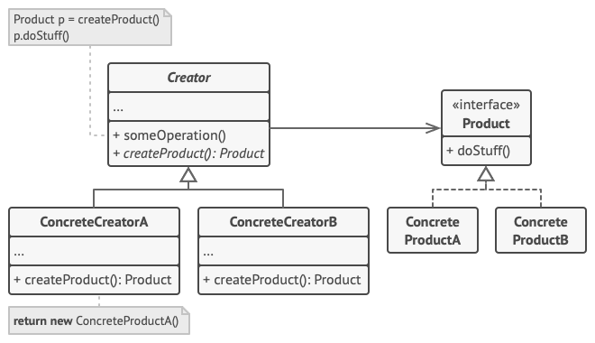

### [Creational Patterns](#creational-patterns)
* [Factory Method](#factory-method)
* [Abstract Factory](#abstract-factory)
* [Builder](#builder)
* [Prototype](#prototype)

# Creational Patterns

## Factory Method 
[(Code Example)](https://github.com/VitaliyRysich/Design-Patterns/tree/master/src/main/java/creational/factory_method)

Factory Method is a creational design pattern that provides an interface for creating objects in a superclass, but allows subclasses to alter the type of objects that will be created.

1. The Product declares the interface, which is common to all objects that can be produced by the creator and its subclasses.
2. Concrete Products are different implementations of the product interface.
3. The Creator class declares the factory method that returns new product objects. It’s important that the return type of this method matches the product interface.
You can declare the factory method as abstract to force all subclasses to implement their own versions of the method. As an alternative, the base factory method can return some default product type.
Note, despite its name, product creation is not the primary responsibility of the creator. Usually, the creator class already has some core business logic related to products. The factory method helps to decouple this logic from the concrete product classes. Here is an analogy: a large software development company can have a training department for programmers. However, the primary function of the company as a whole is still writing code, not producing programmers.
4. Concrete Creators override the base factory method so it returns a different type of product.
Note that the factory method doesn’t have to create new instances all the time. It can also return existing objects from a cache, an object pool, or another source.

### How to Implement
1. Make all products follow the same interface. This interface should declare methods that make sense in every product.
2. Add an empty factory method inside the creator class. The return type of the method should match the common product interface.
3. In the creator’s code find all references to product constructors. One by one, replace them with calls to the factory method, while extracting the product creation code into the factory method.
4. You might need to add a temporary parameter to the factory method to control the type of returned product.
5. At this point, the code of the factory method may look pretty ugly. It may have a large switch operator that picks which product class to instantiate. But don’t worry, we’ll fix it soon enough.
6. Now, create a set of creator subclasses for each type of product listed in the factory method. Override the factory method in the subclasses and extract the appropriate bits of construction code from the base method.
7. If there are too many product types and it doesn’t make sense to create subclasses for all of them, you can reuse the control parameter from the base class in subclasses.
8. For instance, imagine that you have the following hierarchy of classes: the base Mail class with a couple of subclasses: AirMail and GroundMail; the Transport classes are Plane, Truck and Train. While the AirMail class only uses Plane objects, GroundMail may work with both Truck and Train objects. You can create a new subclass (say TrainMail) to handle both cases, but there’s another option. The client code can pass an argument to the factory method of the GroundMail class to control which product it wants to receive.

### Pros
* You avoid tight coupling between the creator and the concrete products.
 * Single Responsibility Principle. You can move the product creation code into one place in the program, making the code easier to support.
 * Open/Closed Principle. You can introduce new types of products into the program without breaking existing client code.
 
 ### Cons
 * The code may become more complicated since you need to introduce a lot of new subclasses to implement the pattern. The best case scenario is when you’re introducing the pattern into an existing hierarchy of creator classes.

## Abstract Factory
[(Code Example)](https://github.com/VitaliyRysich/Design-Patterns/tree/master/src/main/java/creational/abstract_factory)

Abstract Factory is a creational design pattern that lets you produce families of related objects without specifying their concrete classes.

1. Abstract Products declare interfaces for a set of distinct but related products which make up a product family.
2. Concrete Products are various implementations of abstract products, grouped by variants. Each abstract product (chair/sofa) must be implemented in all given variants (Victorian/Modern).
3. The Abstract Factory interface declares a set of methods for creating each of the abstract products.
4. Concrete Factories implement creation methods of the abstract factory. Each concrete factory corresponds to a specific variant of products and creates only those product variants.
5. Although concrete factories instantiate concrete products, signatures of their creation methods must return corresponding abstract products. This way the client code that uses a factory doesn’t get coupled to the specific variant of the product it gets from a factory. The Client can work with any concrete factory/product variant, as long as it communicates with their objects via abstract interfaces.

### How to Implement
1. Map out a matrix of distinct product types versus variants of these products.
2. Declare abstract product interfaces for all product types. Then make all concrete product classes implement these interfaces.
3. Declare the abstract factory interface with a set of creation methods for all abstract products.
4. Implement a set of concrete factory classes, one for each product variant.
5. Create factory initialization code somewhere in the app. It should instantiate one of the concrete factory classes, depending on the application configuration or the current environment. Pass this factory object to all classes that construct products.
6. Scan through the code and find all direct calls to product constructors. Replace them with calls to the appropriate creation method on the factory object.

 ### Pros
 * You can be sure that the products you’re getting from a factory are compatible with each other.
 * You avoid tight coupling between concrete products and client code.
 * Single Responsibility Principle. You can extract the product creation code into one place, making the code easier to support.
 * Open/Closed Principle. You can introduce new variants of products without breaking existing client code.

 ### Cons
 * The code may become more complicated than it should be, since a lot of new interfaces and classes are introduced along with the pattern.

## Builder
[(Code Example)](https://github.com/VitaliyRysich/Design-Patterns/tree/master/src/main/java/creational/builder)

Builder is a creational design pattern that lets you construct complex objects step by step. The pattern allows you to produce different types and representations of an object using the same construction code.

1. The Builder interface declares product construction steps that are common to all types of builders.
2. Concrete Builders provide different implementations of the construction steps. Concrete builders may produce products that don’t follow the common interface.
3. Products are resulting objects. Products constructed by different builders don’t have to belong to the same class hierarchy or interface.
4. The Director class defines the order in which to call construction steps, so you can create and reuse specific configurations of products.
5. The Client must associate one of the builder objects with the director. Usually, it’s done just once, via parameters of the director’s constructor. Then the director uses that builder object for all further construction. However, there’s an alternative approach for when the client passes the builder object to the production method of the director. In this case, you can use a different builder each time you produce something with the director.

### How to Implement
1. Make sure that you can clearly define the common construction steps for building all available product representations. Otherwise, you won’t be able to proceed with implementing the pattern.
2. Declare these steps in the base builder interface.
3. Create a concrete builder class for each of the product representations and implement their construction steps.
4. Don’t forget about implementing a method for fetching the result of the construction. The reason why this method can’t be declared inside the builder interface is that various builders may construct products that don’t have a common interface. Therefore, you don’t know what would be the return type for such a method. However, if you’re dealing with products from a single hierarchy, the fetching method can be safely added to the base interface.
5. Think about creating a director class. It may encapsulate various ways to construct a product using the same builder object.
6. The client code creates both the builder and the director objects. Before construction starts, the client must pass a builder object to the director. Usually, the client does this only once, via parameters of the director’s constructor. The director uses the builder object in all further construction. There’s an alternative approach, where the builder is passed directly to the construction method of the director.
7. The construction result can be obtained directly from the director only if all products follow the same interface. Otherwise, the client should fetch the result from the builder.

### Pros
* You can construct objects step-by-step, defer construction steps or run steps recursively.
* You can reuse the same construction code when building various representations of products.
* Single Responsibility Principle. You can isolate complex construction code from the business logic of the product.

### Cons
* The overall complexity of the code increases since the pattern requires creating multiple new classes.

## Prototype
[(Code Example)](https://github.com/VitaliyRysich/Design-Patterns/tree/master/src/main/java/creational/prototype)

Prototype is a creational design pattern that lets you copy existing objects without making your code dependent on their classes.

1. The Prototype interface declares the cloning methods. In most cases, it’s a single clone method.
2. The Concrete Prototype class implements the cloning method. In addition to copying the original object’s data to the clone, this method may also handle some edge cases of the cloning process related to cloning linked objects, untangling recursive dependencies, etc.
3. The Client can produce a copy of any object that follows the prototype interface.

### How to Implement
1. Create the prototype interface and declare the clone method in it. Or just add the method to all classes of an existing class hierarchy, if you have one.
2. A prototype class must define the alternative constructor that accepts an object of that class as an argument. The constructor must copy the values of all fields defined in the class from the passed object into the newly created instance. If you’re changing a subclass, you must call the parent constructor to let the superclass handle the cloning of its private fields.
3. If your programming language doesn’t support method overloading, you may define a special method for copying the object data. The constructor is a more convenient place to do this because it delivers the resulting object right after you call the new operator.
4. The cloning method usually consists of just one line: running a new operator with the prototypical version of the constructor. Note, that every class must explicitly override the cloning method and use its own class name along with the new operator. Otherwise, the cloning method may produce an object of a parent class.
5. Optionally, create a centralized prototype registry to store a catalog of frequently used prototypes.
6. You can implement the registry as a new factory class or put it in the base prototype class with a static method for fetching the prototype. This method should search for a prototype based on search criteria that the client code passes to the method. The criteria might either be a simple string tag or a complex set of search parameters. After the appropriate prototype is found, the registry should clone it and return the copy to the client.
7. Finally, replace the direct calls to the subclasses’ constructors with calls to the factory method of the prototype registry.

### Pros
* You can clone objects without coupling to their concrete classes.
* You can get rid of repeated initialization code in favor of cloning pre-built prototypes.
* You can produce complex objects more conveniently.
* You get an alternative to inheritance when dealing with configuration presets for complex objects.

### Cons
* Cloning complex objects that have circular references might be very tricky.

